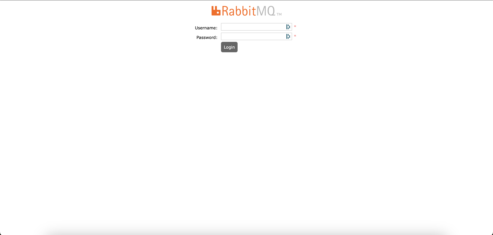
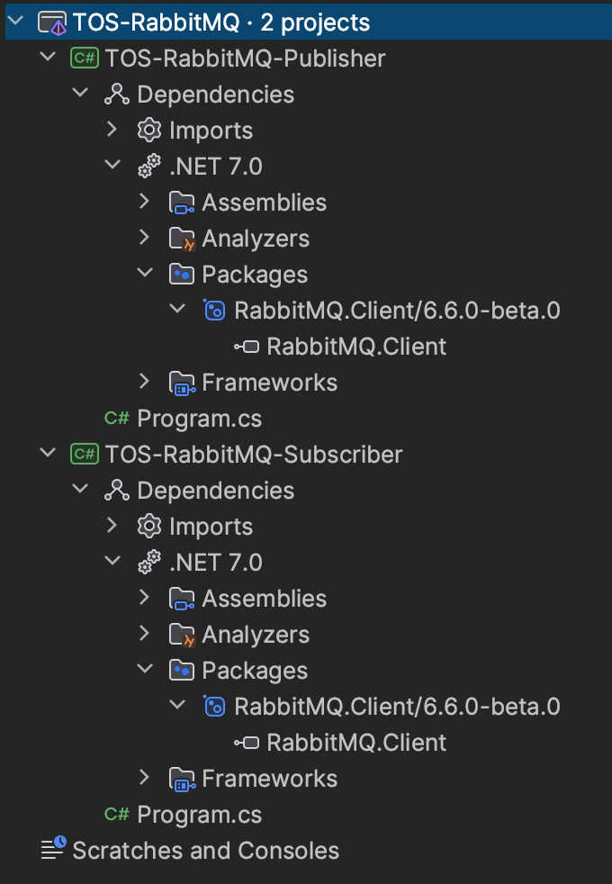
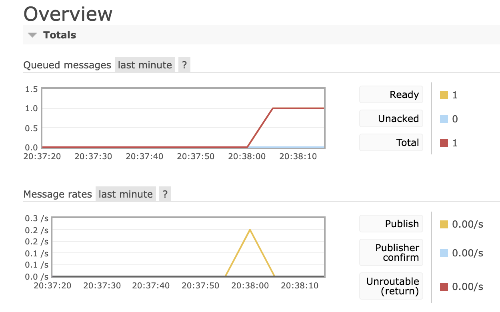
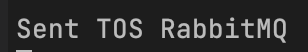

# TOS RabbitMQ

Ce TOS a pour objectif d'expliquer le fonctionnement basique de RabbitMQ.

Nous allons donc mettre en place un conteneur docker basé sur l'image de RabbitMQ et vérifier son bon fonctionnement.

Commande pour récupérer l'image RabbitMQ depuis DockerHub.

```bash
docker pull rabbitmq:management
```

> Le tag :management permet d'obtenir l'image docker qui permet de lancer le conteneur et d'avoir une interface graphique.

Commande pour créer le conteneur docker.

```bash
docker run -d -p 5672:5672 -p 15672:15672 --hostname rabbit-mq-tos --name rabbit-mq-container -e RABBITMQ_DEFAULT_USER=user -e RABBITMQ_DEFAULT_PASS=password rabbitmq:management
```

Une fois le conteneur créé, nous avons accès à l'interface RabbitMQ à l'adresse : `http://localhost:15672/`



Renseignez vos identifiants et accédez au dashboard.

Nous allons ensuite créer 2 applications console .NET afin de tester le serveur RabbitMQ.



Ici, j'ai créé 1 solution avec 2 projets console à l'intérieur, un publisher et un subscriber. J'ai également ajouté le package `RabbitMQ.Client` dans chacun des projets.

Vous pouvez ajouter le package grâce à la commande suivante : 
```bash
dotnet add package RabbitMQ.Client --version 6.6.0-beta.0
```

On peut ensuite ajouter ces lignes de code pour le `Program.cs` du projet Publisher.

```bash
using System.Text;
using RabbitMQ.Client;

var factory = new ConnectionFactory { HostName = "localhost", UserName = "user", Password = "password"};
using var connection = factory.CreateConnection();
using var channel = connection.CreateModel();

channel.QueueDeclare(queue: "tos", durable: false, exclusive: false, autoDelete: false, arguments: null);

const string message = "TOS RabbitMQ";

var body = Encoding.UTF8.GetBytes(message);

channel.BasicPublish(exchange: string.Empty, routingKey: "tos", basicProperties: null, body: body);

Console.WriteLine($"Sent {message}");
Console.ReadLine();
```

Et ces lignes pour le `Program.cs` du projet subscriber.

```bash
using System.Text;
using RabbitMQ.Client;
using RabbitMQ.Client.Events;

var factory = new ConnectionFactory { HostName = "localhost", UserName = "user", Password = "password"};

using var connection = factory.CreateConnection();
using var channel = connection.CreateModel();

channel.QueueDeclare(queue: "tos", durable: false, exclusive: false, autoDelete: false, arguments: null);

Console.WriteLine("Waiting for messages.");

var consumer = new EventingBasicConsumer(channel);
consumer.Received += (model, ea) =>
{
    var body = ea.Body.ToArray();
    var message = Encoding.UTF8.GetString(body);
    Console.WriteLine($"Received {message}");
};
channel.BasicConsume(queue: "tos",
    autoAck: true,
    consumer: consumer);

Console.WriteLine(" Press a key to exit.");
Console.ReadLine();
```

Nous avons donc créé un publisher (qui va envoyer les messages), et un subscriber (qui va recevoir les messages).

Lorsque vous allez lancer le projet console Publisher, vous allez envoyer un message, ici "TOS RabbitMQ" au serveur que vous venez de mettre en place dans un conteneur.



Nous voyons dans la console qu'un message a bien été envoyé sur le serveur RabbitMQ.



Désormais, le message a été envoyé sur le serveur, on va alors lancer le projet Subscriber pour qu'il puisse écouter sur le même canal et recevoir le message.


On peut voir ici que le Subscriber a bien reçu le message qui a été envoyé par le Publisher sur le serveur RabbitMQ.
